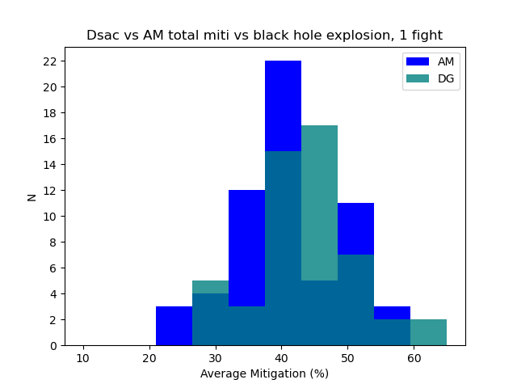

# Aura Mastery vs Divine Guardian for raid damage reduction.

## What the theorycrafting says

The increase to damage resists should be the following:
- baseline aura: 20% dr
- aura with AM : 34% dr
- cancelled dsac with no aura: 20% dr
- cancelled dsac with aura: 36%
- uncancelled dsac on party with no aura: 44%
- uncancelled dsac on party with aura: 55%

For more info on how these are calculated vs a lvl 83 boss mob see:
https://wowpedia.fandom.com/wiki/Resistance

## Why this doc?

Someone was insisting today in ret-questions that AM was providing better mitigation than DG, over "every log they looked at across 10 kills".

Now, given the amount of time it took for me to go through the data for one kill, I highly doubt this person rigorously checked 10 logs...

But anyway, the expected differences of Damage Reduction (DR) between the two are exceptionally small relative to the very high variance in DR that your elemental resist can roll.
So you shouldn't be able to meaningfully say anything about which one is better from empirical data unless you were looking at a few tens or even a few hundreds of kills.

Is the data consistent with the theory over a single log?

## Let's look at a random log

Let's have a look at one of my guild's Algalon kills and look at the mitigations from Divine Guardian vs AM.

WCL link: https://classic.warcraftlogs.com/reports/RBxK7mGNdZgQp9yf#fight=59

This kill was interesting because we had the following cooldown usage:

Black holes:
1 - 0:27 - AM (Pinkmale)
2 - 0:53 - DG (Pinkmale)
3 - 1:14 - DG (Attlee)
4 - 1:46 - AM (Attlee)
5 - 2:14 - DG (Tomcatfish)
6 - 2:30 - DG & AM (Pukko/Retail)
7 - 2:51 - nothing
8 - 3:25 - nothing
9 - 3:43 - AM (Attlee)

We nominally have three instances of just a cancelled DG, three instances of just AM, one instance where we used both at the same time by accident, and two instances where we used no external.
Shadow resist aura is active all fight.
Let's look at some of the individual hits people took where they don't have personal mitigation spells active (e.g. Feint) to simplify things.

We also note that Tomcatfish is tank so DG at 2:10 misses a lot of ranged who position incorrectly, hence some missing data.

What are the total mitigations of each explosion hit, separated into the type of external that was used?

## Results

Full data is in an appendix, but the final figures were:

```
Average miti for AM                      = (41.1 +/- 8.1)%
Average miti for aura + DG               = (43.6 +/- 8.5)%
Average miti for both                    = (51.7 +/- 6.6)%
Average miti for aura only (no external) = (28.3 +/- 8.2)%
```

So yes, the data from one log is entirely consistent with the theory, with both mitigations being in one standard error of the expected values from theory.

We also note that in this log DSac provided a higher (but not statistically significant) average mitigation. First one I checked. Who'd have imagined it.

These are also presented in graphs below for just AM vs DG:



And including the instances of both externals, and including no externals:


# Appendix: data from log

```
All in percent.

_AM_
Attlee 1 - 32.1
Attlee 4 - 51.5
Attlee 9 - 22.4
Vim 1    - 25.1
Vim 4    - 38.9
Vim 9    - 28.7
Brut 1   - 22.4
Brut 4   - 41.8
Brut 9   - 41.8
Papa 1   - 34.8
Papa 4   - 53.4
Papa 9   - 44.1
Bisel 1  - 34.8
Bisel 4  - 34.8
Bisel 9  - 53.4
Veri 1   - 40.0
Veri 4   - 40.0
Veri 9   - 30.0
Shmaa 1  - 36.2
Shmaa 4  - 36.2
Shmaa 9  - 36.2
Pukko 1  - 41.8
Pukko 4  - 41.8
Pukko 0  - 41.8
Beu    1 - 40.1
Beu    4 - 30.0
Beu    9 - 50.0
Rushte 1 - 41.8
Rushte 4 - 30.2
Lepsy  1 - 41.8
Lepsy  4 - 41.8
Lepsy  9 - 41.8
Tinder 1 - 54.4
Tinder 4 - 54.4
Tinder 9 - 36.2
Holywi 1 - 50.5
Holywi 4 - 50.5
Holywi 9 - 58.8
Dark   1 - 44.7
Dark   4 - 49.1
Dark   9 - 43.0
Shifty 1 - 36.2
Shifty 4 - 45.2
Shifty 9 - 45.2
Pink   1 - 51.5
Pink   9 - 32.1
Papi   1 - 32.1
Papi   4 - 51.5
Papi   9 - 41.8
Gryf   1 - 41.8
Gryf   4 - 32.1
Gryf   9 - 41.8
Emoa   1 - 51.5
Emoa   4 - 41.8
Emoa   9 - 41.8
Swedge 1 - 41.8
Swedge 4 - 51.5
Swedge 9 - 41.8
Beef   1 - 41.8
Beef   4 - 41.8

_DG_
Attlee  2 - 35.7
Attlee  3 - 37.9
Attlee  5 - 37.9
Vim     2 - 34.8
Vim     3 - 26.7
Vim     5 - 31.2
Brut    2 - 37.9
Brut    3 - 37.9
Papa    2 - 33.0
Bisel   2 - 47.9
Bisel   3 - 40.4
Bisel   5 - 47.9
Veri    2 - 44.1
Veri    3 - 28.1
Veri    5 - 28.1
Shmaa   2 - 41.6
Shmaa   3 - 41.6
Pukko   2 - 45.7
Pukko   3 - 37.9
Pukko   5 - 37.9
Beu     2 - 44.1
Beu     3 - 28.1
Beu     5 - 44.0
Rushtea 2 - 37.9
Rushtea 3 - 45.7
Lepsy   2 - 61.2
Lepsy   3 - 45.7
Lepsy   5 - 45.7
Tinder  2 - 41.6
Tinder  3 - 56.2
Tinder  5 - 41.6
Holywit 2 - 53.8
Holywit 3 - 53.8
Dark    2 - 45.9
Dark    3 - 64.6
Dark    5 - 48.4
Shifty  2 - 59.2
Shifty  3 - 48.9
Shifty  5 - 53.3
Pink    2 - 53.4
Pink    3 - 45.7
Pink    5 - 37.9
Papi    2 - 37.9
Papi    5 - 37.9
Gryf    3 - 45.7
Emoa    2 - 45.7
Emoa    3 - 53.4
Emoa    5 - 53.4
Swedge  3 - 45.7
Swedge  5 - 45.7
Beef    5 - 45.7

_AM&DG_
Attlee 6 - 53.4%
Vim    6 - 40.1%
Brut   6 - 45.7%
Papa   6 - 62.8%
Bisel  6 - 47.85%
Veri   6 - 52.04%
Shmaa  6 - 56.2%
Pukko  6 - 45.7%
Beu    6 - 52.0%
Lepsy  6 - 53.4%
Tinder 6 - 56.2%
Dark   6 - 59.1%
Shifty 6 - 48.9%
Pink   6 - 61.2%
Papi   6 - 53.4%
Gryf   6 - 53.4%
Swedge 6 - 37.9%

_Unmitigated_
Attlee 7 - 22.4%
Attlee 8 - 22.4%
Vim    7 - 18.5%
Vim    8 - 28.7%
Brut   5 - 22.4% (outranged dsac)
Brut   7 - 22.4%
Brut   8 - 12.7%
Papa   3 - 34.8% (outranged dsac)
Papa   5 - 16.2% (outranged dsac)
Papa   7 - 16.2%
Papa   8 - 25.5%
Bisel  7 - 25.5%
Bisel  8 - 25.5%
Veri   7 - 40.0%
Veri   8 - 30.0%
Shmaa  5 - 27.0% (outranged dsac)
Shmaa  7 - 34.2%
Shmaa  8 - 27.0%
Pukko  7 - 22.4%
Pukko  8 - 22.4%
Beu    7 - 30.1%
Beu    8 - 40.0%
Lepsy  7 - 32.1%
Lepsy  8 - 37.9%
Tinder 7 - 36.2%
Tinder 8 - 27.0%
Dark   7 - 33.7%
Dark   8 - 33.4%
Shifty 7 - 36.2%
Shifty 8 - 48.9%
Pink   7 - 32.1%
Pink   8 - 12.7%
Papi   7 - 41.8%
Papi   8 - 32.1%
Gryf   8 - 22.4%
Emoa   7 - 32.1
Emoa   8 - 22.4
```